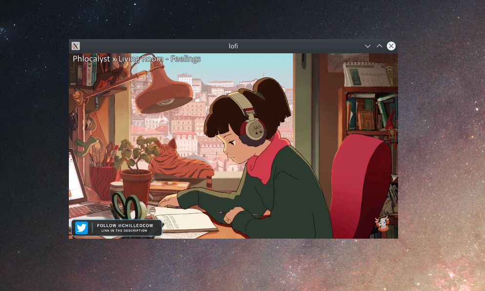

# lofi


Excuse my lack of knowledge of Electron. I think this should work on linux (but also similarly on Mac/Windows):

```npx create-electron-app lofi```

move files from this repo into the created repo

```cd lofi```

```npm install --save-dev electron-aspect-ratio-browser-window```

```./node_modules/.bin/electron-packager .```

```./<builddir>/lofi```